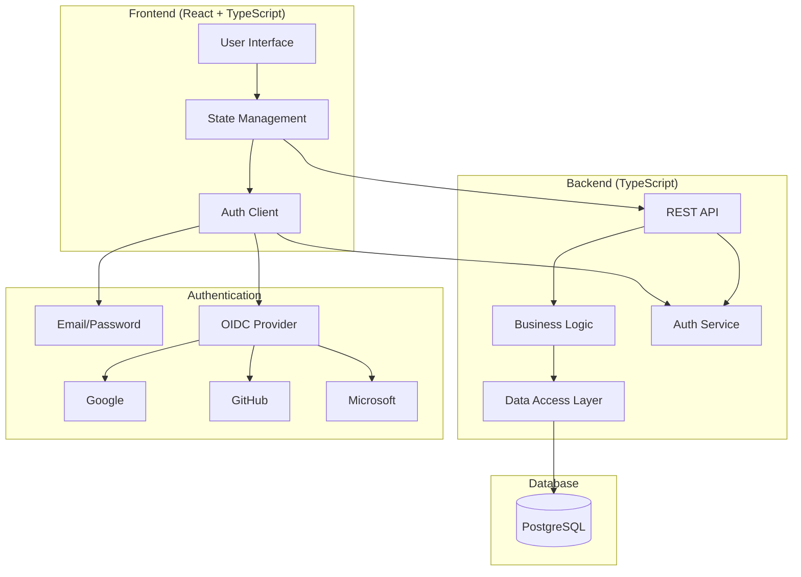
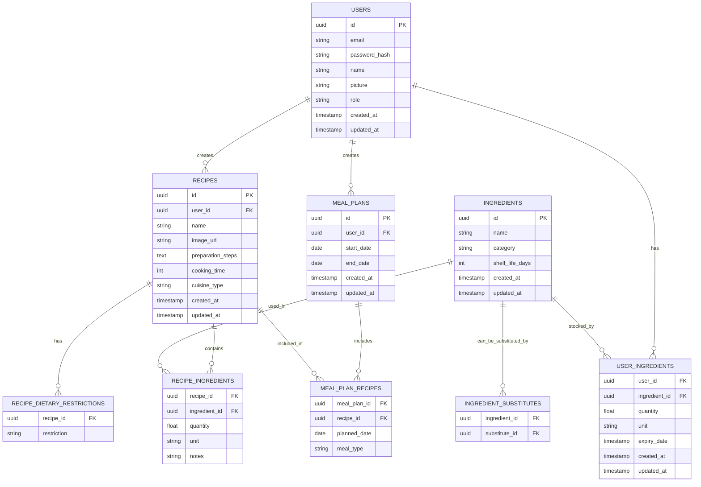
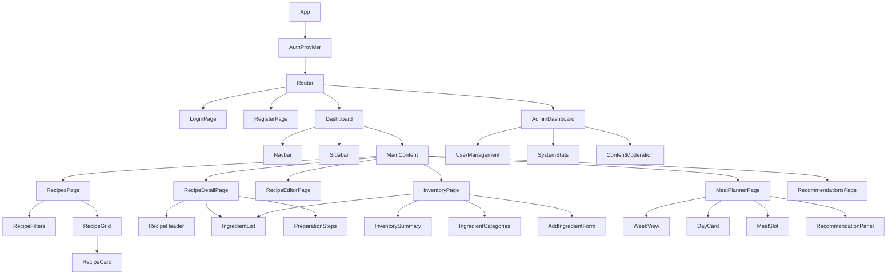
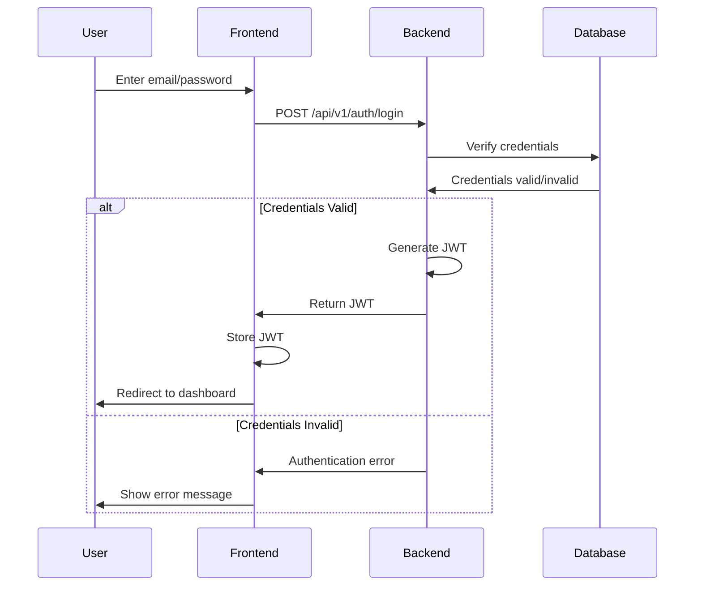
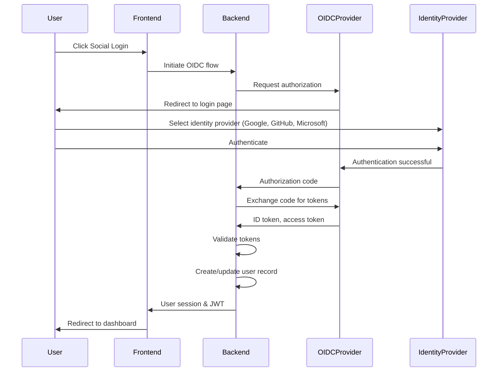
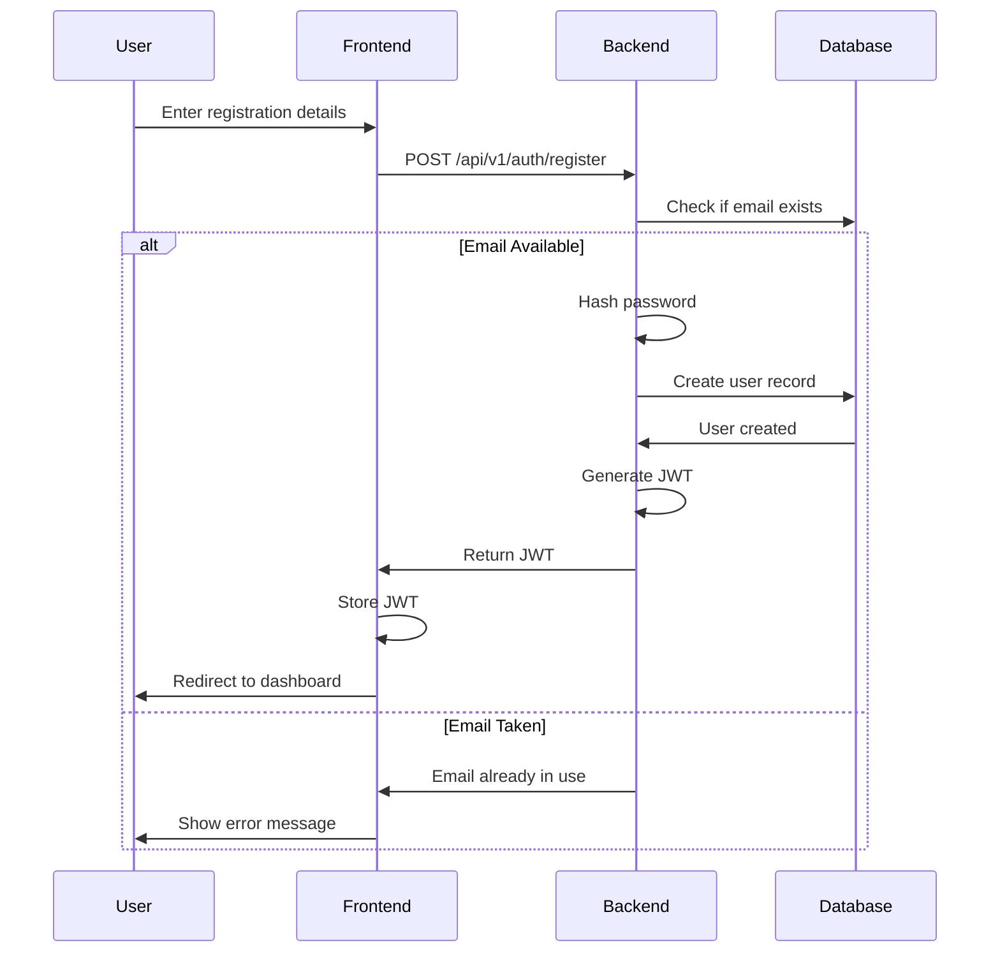
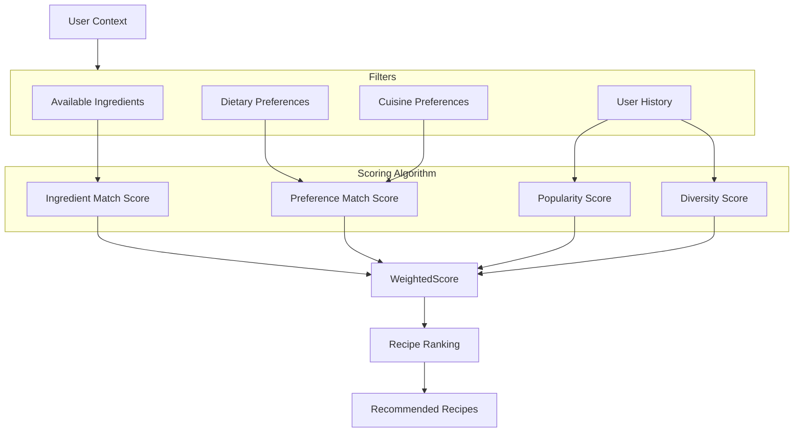
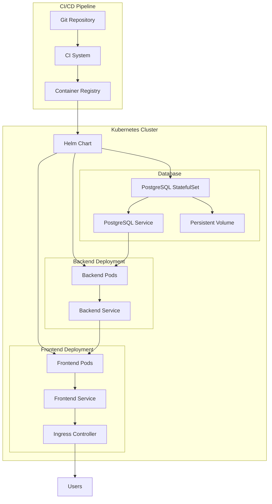

# FeedMe: Recipe Management Application Architecture Plan

## 1. System Architecture

The application will follow a modern three-tier architecture with clear separation of concerns:



## 2. Database Schema



## 3. User Roles and Permissions

The application will support the following user roles:

### 3.1 Role Types

1. **Admin**
   - Full system access
   - User management capabilities
   - Content moderation
   - System configuration

2. **Regular User**
   - Manage personal recipes
   - Manage personal ingredient inventory
   - Create and manage meal plans
   - Access recommendations

3. **Guest** (Unauthenticated)
   - View public recipes
   - Register for an account

### 3.2 Permission Matrix

| Resource/Action | Admin | Regular User | Guest |
|-----------------|-------|--------------|-------|
| **Users** |
| View all users | ✅ | ❌ | ❌ |
| Manage users | ✅ | ❌ | ❌ |
| **Recipes** |
| Create recipes | ✅ | ✅ | ❌ |
| View own recipes | ✅ | ✅ | ❌ |
| Edit own recipes | ✅ | ✅ | ❌ |
| Delete own recipes | ✅ | ✅ | ❌ |
| View public recipes | ✅ | ✅ | ✅ |
| Edit any recipe | ✅ | ❌ | ❌ |
| Delete any recipe | ✅ | ❌ | ❌ |
| **Ingredients** |
| Manage global ingredients | ✅ | ❌ | ❌ |
| Manage own inventory | ✅ | ✅ | ❌ |
| **Meal Plans** |
| Create meal plans | ✅ | ✅ | ❌ |
| View own meal plans | ✅ | ✅ | ❌ |
| Edit own meal plans | ✅ | ✅ | ❌ |
| **System** |
| View system stats | ✅ | ❌ | ❌ |
| Configure system | ✅ | ❌ | ❌ |

### 3.3 Implementation Strategy

The permission system will be implemented using:

1. **Role-based access control (RBAC)** at the API level
   - Middleware to check user roles and permissions
   - Decorators/annotations for route protection

2. **Row-level security** in PostgreSQL
   - Ensure users can only access their own data
   - Admin override for management functions

3. **UI-level permission checks**
   - Hide or disable UI elements based on user role
   - Prevent unauthorized actions from being attempted

## 4. Backend Components

### 4.1 Core Services

1. **AuthService**
   - Handles both local (email/password) authentication
   - Manages OIDC authentication flow for social logins
   - User registration and account management
   - Password reset functionality
   - Role-based access control
   - Manages user sessions and tokens
   - Integrates with Google, GitHub, and Microsoft identity providers

2. **RecipeService**
   - CRUD operations for recipes
   - Search and filtering capabilities
   - Recipe collection management

3. **IngredientService**
   - CRUD operations for ingredients
   - Ingredient categorization
   - Substitute management

4. **InventoryService**
   - User ingredient inventory management
   - Expiry tracking
   - Low stock alerts

5. **RecommendationService**
   - Smart recipe recommendations based on:
     - Available ingredients
     - Dietary preferences
     - Cuisine preferences
     - Past selections
     - Random suggestions

6. **MealPlanService**
   - Weekly meal plan generation
   - Meal plan management
   - Shopping list generation

7. **AdminService**
   - User management
   - System statistics and monitoring
   - Content moderation

### 4.2 API Layer

The REST API will follow a resource-oriented design with the following main endpoints:

```
/api/v1/auth - Authentication endpoints
/api/v1/users - User management
/api/v1/recipes - Recipe CRUD operations
/api/v1/ingredients - Ingredient CRUD operations
/api/v1/inventory - User ingredient inventory
/api/v1/recommendations - Recipe recommendations
/api/v1/meal-plans - Meal planning
/api/v1/admin - Admin-only endpoints
```

## 5. Frontend Components

### 5.1 Core Pages

1. **Authentication Pages**
   - Login (Email/Password and Social)
   - Registration (Email/Password and Social)
   - Password Reset
   - Profile management

2. **Recipe Management**
   - Recipe browser with filters
   - Recipe detail view
   - Recipe editor
   - Collection management

3. **Ingredient Inventory**
   - Inventory dashboard
   - Add/edit ingredients
   - Expiry tracking
   - Shopping list

4. **Meal Planning**
   - Weekly planner view
   - Recommendation integration
   - Drag-and-drop meal assignment
   - Plan generation

5. **Admin Dashboard** (Admin only)
   - User management
   - System statistics
   - Content moderation

### 5.2 Component Hierarchy



## 6. Authentication Flow

### 6.1 Email/Password Authentication



### 6.2 Social Login Authentication



### 6.3 Registration Flow



## 7. Recommendation Engine

The recommendation engine will use a scoring system based on multiple factors:



## 8. Deployment Strategy



## 9. Development Roadmap

### Phase 1: Foundation
- Set up project structure and development environment
- Implement authentication (both local and OIDC)
- Create database schema and migrations
- Develop core API endpoints
- Build basic UI components
- Implement role-based access control

### Phase 2: Core Features
- Complete recipe management functionality
- Implement ingredient inventory system
- Develop basic recommendation engine
- Create user profile and preferences

### Phase 3: Advanced Features
- Enhance recommendation engine with machine learning
- Implement meal planning functionality
- Add shopping list generation
- Develop admin dashboard and tools

### Phase 4: Optimization and Scaling
- Performance optimization
- Implement caching strategies
- Add analytics and monitoring
- Enhance security measures

### Phase 5: Deployment and Launch
- Set up CI/CD pipeline
- Create Kubernetes Helm charts
- Deploy to production environment
- Conduct user acceptance testing

## 10. Technology Stack Summary

- **Frontend**:
  - React with TypeScript
  - Redux or Context API for state management
  - React Router for navigation
  - Styled Components or Material UI for styling
  - Jest and React Testing Library for testing

- **Backend**:
  - Node.js with Express or NestJS
  - TypeScript
  - TypeORM or Prisma for database access
  - Passport.js for authentication (local and OIDC)
  - Jest for testing

- **Database**:
  - PostgreSQL
  - Redis for caching (optional)

- **DevOps**:
  - Docker for containerization
  - Kubernetes for orchestration
  - Helm for package management
  - GitHub Actions or Jenkins for CI/CD